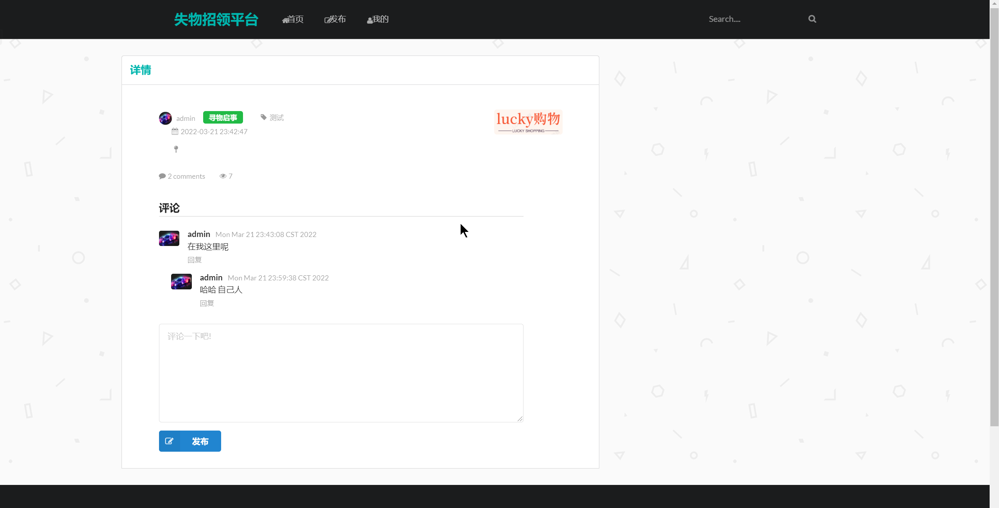
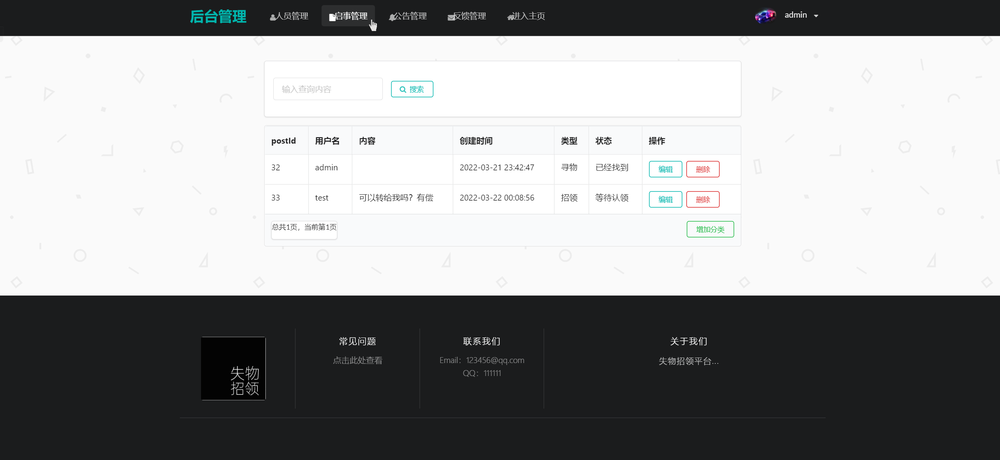
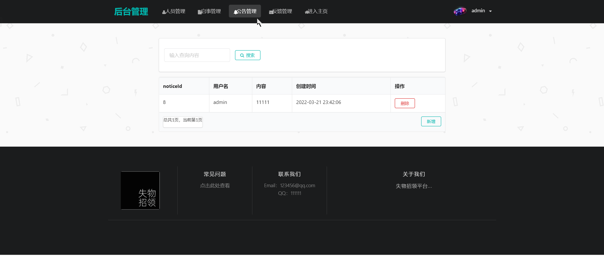

## 基于SpringBoot的失物招领平台

- <b>完整代码获取地址：从戎源码网 ([https://armycodes.com/](https://armycodes.com/))</b>
- <b>技术探讨、资料分享，请加QQ群：692619798</b> 
- <b>作者微信：19941326836  QQ：952045282</b> 
- <b>承接计算机毕业设计、Java毕业设计、Python毕业设计、深度学习、机器学习</b>
- <b>选题+开题报告+任务书+程序定制+安装调试+论文+答辩ppt 一条龙服务</b>
- <b>所有选题地址 ([https://github.com/YuLin-Coder/AllProjectCatalog](https://github.com/YuLin-Coder/AllProjectCatalog)) </b>

## 项目介绍
基于SpringBoot的失物招领平台，有用户和管理员两个角色，主要功能如下
失物招领系统功能介绍如下：

### 【管理员】:
- 人员管理：管理员可以对系统中的用户进行管理，包括添加、编辑和删除用户的基本信息。
- 启事管理：管理员可以审核和管理用户发布的失物信息，包括发布状态、处理状态等。
- 公告管理：管理员可以发布系统公告，包括寻物启事、招领信息等，提供给用户查看。
- 反馈管理：管理员可以查看用户的反馈信息，包括用户对失物招领系统的意见、建议等。
- 管理员可以记录丢失物品的详细信息
- 管理员可以对已找回的失物进行标记
- 管理员可以根据失物分类进行管理

### 【用户】:
- 发布失物公告：用户可以发布自己的失物信息
- 失物分类：用户可以根据失物的类型进行分类查看
- 我的报失信息：用户可以查看自己发布的失物信息

## 项目技术
- 编程语言：Java
- 数据库：MySQL
- 项目管理工具：Maven
- 前端技术：Thymeleaf、Jquery
- 后端技术：Spring、SpringMVC、MyBatis

## 运行环境
- JDK版本：JDK1.8及以上
- 开发工具：IDEA、Ecplise、Myecplise都可以
- 数据库: MySQL5.7及以上
- Maven：maven3.0及以上

## 运行截图

